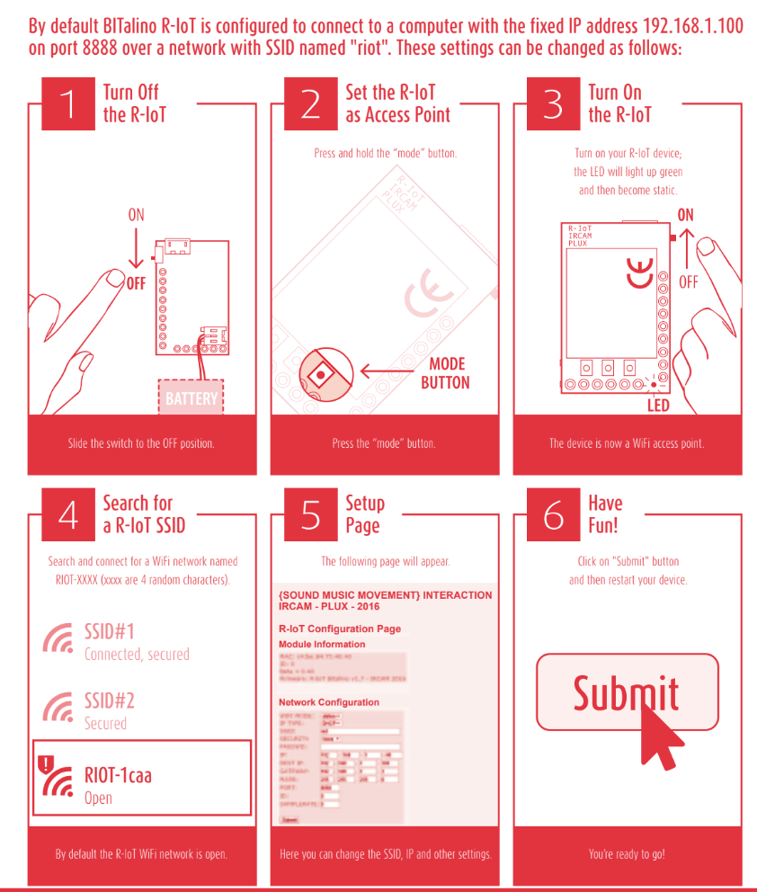

# Pairing Multiple Devices to a Single Host

## Overview

The R-IoT's WiFi capabilities make it possible to stream data from many modules at once. This is done by assigning a unique ID number to each device and connecting them to the same network. From here, it is possible to refer to the specific device by listening for OSC message under the address format **/&lt;id&gt;/raw**.

In our tests we use the following:

* BITalino R-IoTs - [https://plux.info/kits/376-bitalino-r-iot-810121007.html](https://plux.info/kits/376-bitalino-r-iot-810121007.html)
* TP-Link MR3020 WiFi router - [https://plux.info/accessories/403-wireless-route-bitalino-riot-810121713.html](https://plux.info/accessories/403-wireless-route-bitalino-riot-810121713.html) 

## Assigning Device IDs Using the Configuration Page

Step one, turn on the R-IoT whilst holding down the on-board **mode** button. The LED should flash rapidly then become static.

A new Wi-Fi network named **RIOT-\[4 random characters\]** will become available



_For more information, see the_ [_Quick-start Guide_](https://bitalino.com/downloads/quickstart-guide-riot-1.0.0.12-print.pdf)

Connect to this network and go to the following address from your browser: `192.168.1.1`

From here, you can set the **ID** accordingly. We suggest setting the first device ID to 0 and increasing consecutively for each device \(second device is set to 1, next is 2, etc...\)


In order to access data from all devices simultaneously, all devices must be paired to the same network SSID and sending to the same **IP** and **PORT** \(_192.168.1.100_ and _8888_ by default\)

Other parameters that must be set for each module: **WIFI MODE:** station, **IP TYPE:** DHCP

## Accessing Device Data 

OSC messages from the R-IoT consists of an OSC Address Pattern followed by an OSC Type Tag String followed by and array of 22 values. Each device will send data with a unique message address defined by the module ID set in the previous step. For example, to filter message that are coming from device 0, we listen for the address **/0/raw.**

OSC libraries such as [python-osc](https://pypi.org/project/python-osc/) support wildcards; this is useful for listening to all devices in the network. To get started using the R-IoT with this library, please see the python example in the [bitalino riot templates](https://github.com/wprimett/bitalino_riot_templates).

```text
## Code snippet from python template
def riot_handler(addr, *data):
    str_output = ""
    for i, lbl in enumerate(labels):
        str_output += "%s: %f," % (lbl, data[i])
        print(str_output[:-1])
        print("")

if __name__ == "__main__":
    ## Set arguments to match configuration
    parser = argparse.ArgumentParser()
    parser.add_argument("--ip",
        default="192.168.1.100", help="The ip to listen on")
    parser.add_argument("--port",
        type=int, default=8888, help="The port to listen on")
    args = parser.parse_args()
            
    ## Use wildcard argument in OSC listener        
    dispatcher = dispatcher.Dispatcher()
    dispatcher.map("/*/raw", riot_handler)
                
    server = osc_server.ThreadingOSCUDPServer((args.ip, args.port), dispatcher)
    print("Serving on {}".format(server.server_address))
    server.serve_forever()
```

## Maximum Number R-IoTs Per Router

> With the BITalino R-IoT becoming increasingly popular in use cases where multiple devices are used simultaneously, a common question has been if it's possible to use several units at once and the maximum number of units per router / access point.
>
> It's possible \(and meant for\) to use several R-IoT at the same time. The limitation is the WiFi bandwith on a single channel, reason for which we usually recommend maximum 3-4 riots @5ms sample period per WiFi channel.
>
> From there, you can either increase the sample period to 10ms to have more devices on the same router / access point, or \(recommended\) use several WiFi access points with different network names and on different channels to increase the number of modules used at the same time.
>
> [_Maximum number of BITalino R-IoTs in a single router_](https://forum.bitalino.com/viewtopic.php?f=1&t=488)\_\_

#### Connecting More Than 4 Devices at Once

For a setup that requires more than 4 devices, there are two options available:

1. Follow the instructions [here](https://forum.bitalino.com/viewtopic.php?f=1&t=511) to merge incoming data from two routers
2. Lower the sampling rate from the configuration page, for example, to 10ms


