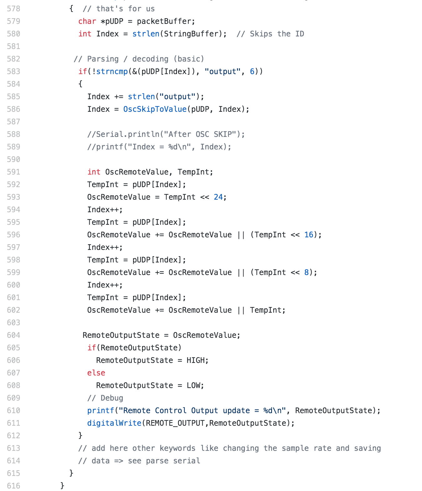
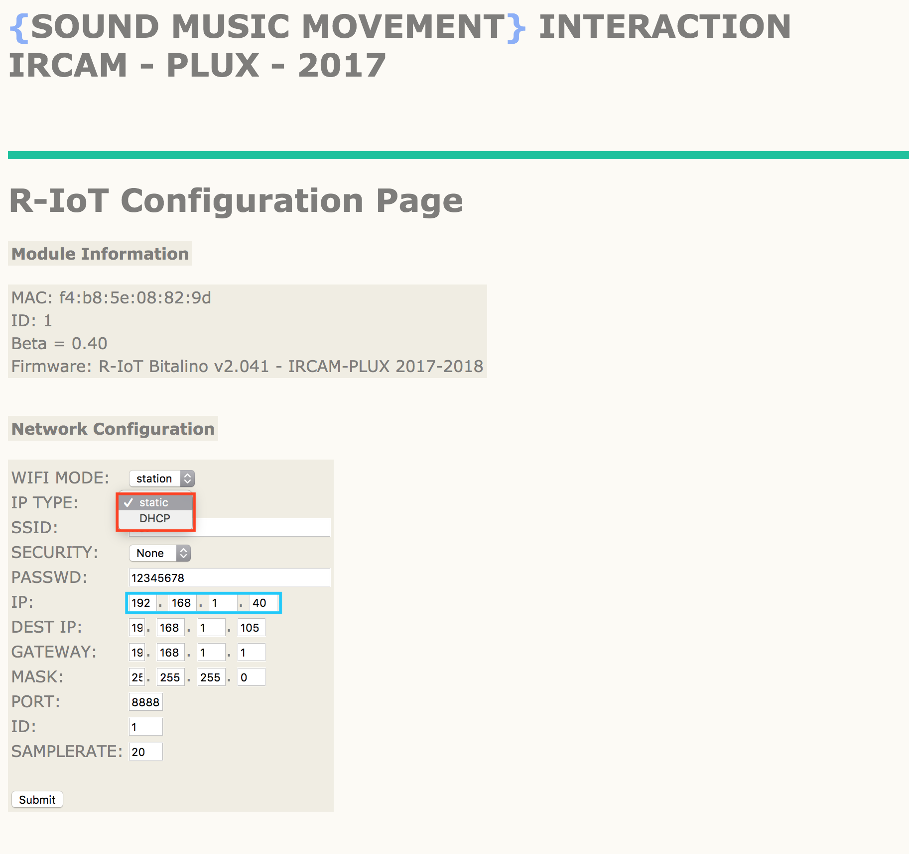
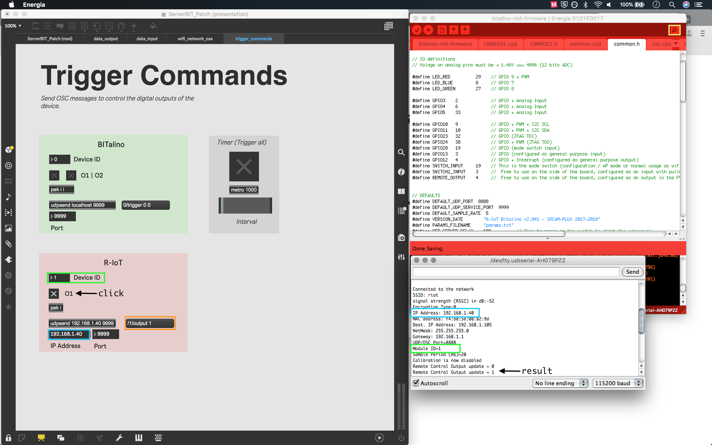

# Remote Control of Digital Output with OSC Messages

### Introduction

This page will guide the process of controlling an output signal of a BITalino R-IoT module with control messages using Open Sound Control \(OSC\). These can be sent over a shared local Wi-Fi network from any application with an OSC server. The R-IoT's [standard firmware](https://github.com/BITalinoWorld/firmware-bitalino-riot) includes an OSC listener that's initialized once the device is switched on; this can be used to control the on-board digital output pin with an output sate of **0** or **1**. 



### Message Format and Configuration

The OSC message requires three arguments: an IP address, port number and an message address. 

* The device's local IP should be set to **static** from the configuration page. In this example we'll use the default address `192.168.1.40`
* The default service port is set as `9999`
* The message format is /&lt;id&gt;/output where the module ID number must match what is assigned to the configuration. You can use this format to manage multiple devices within the same local network

For more information on the accessing the device configuration, please see the [_Quick-start Guide_](https://bitalino.com/downloads/quickstart-guide-riot-1.0.0.12-print.pdf)_._



The message must then be followed by an integer to determine the output sate. We'll present two examples that can be used to test this method.

### Test \#1 ServerBIT

In the example below, we use [ServerBIT MAX](https://gitlab.com/weselle/severbit-revolution-max) to switch between sending `/1/output 0` and `/1/output 1`  to the address `192.168.1.40` on port `9999`using a toggle. To test, connect the R-IoT to the computer's USB port, launch Energia and open the serial monitor. From here, switch on the device and wait some seconds for the connection and calibration process before sending new OSC control messages. If the connection is successful, new lines should print in the console when a new message is received: 



### Test \#2 Processing

Below is a simple Processing sketch that uses the [oscP5 library](http://www.sojamo.de/libraries/oscP5/) to send messages over the network. The network parameters are kept the same as the above, and the message format is the same. First check the module ID matches the configuration before running the sketch, then click on the screen to switch between sending `/<id>/output 0` and  `/<id>/output 1`

```java
/**
 * Basic R-IoT OSC trigger example
 * adapted from oscP5message examle by andreas schlegel
 * oscP5 website at http://www.sojamo.de/oscP5
 */
import oscP5.*;
import netP5.*;
OscP5 oscP5;
NetAddress RiotLocation;

String riot_address = "192.168.1.40";
int service_port = 9999;
int module_id = 0;
boolean output_state = false;

void setup() {
  size(400,400);
  frameRate(25);
  /* start oscP5, as we are not listening for any OSC messages in processing, the port is set to 0 */
  oscP5 = new OscP5(this,0);
  
  //enter the static IP and default service port of the R-IoT
  RiotLocation = new NetAddress(riot_address, service_port);
}


void draw() {
  background(0);  
}

void mousePressed() {
  //toggle output state
  output_state = !output_state;
  //apply message format /<id>/output 
  String msg_addr = "/" + str(module_id) + "/output";
  OscMessage myMessage = new OscMessage(msg_addr);
  
  int msg_val = int(output_state);
  myMessage.add(msg_val); /* add an int to the osc message */
  println("output message: " + msg_addr + " " + str(msg_val));
  /* send the message to the remote location */
  oscP5.send(myMessage, RiotLocation); 
  println("sent to remote location: " + riot_address + " on port " + service_port);
}
```

[https://gist.github.com/wprimett/9eb34757478eab2e443ed6f8a0cc81d2](https://gist.github.com/wprimett/9eb34757478eab2e443ed6f8a0cc81d2)

