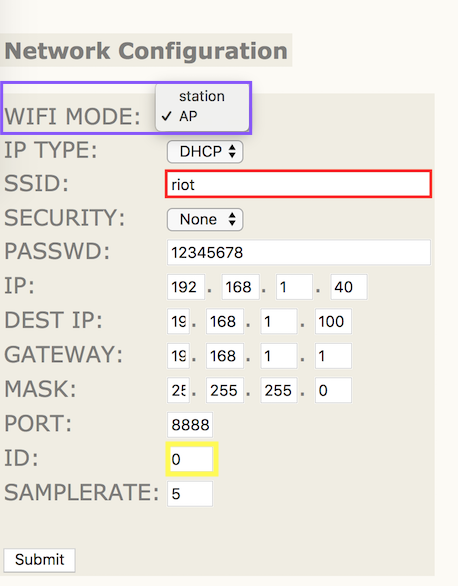
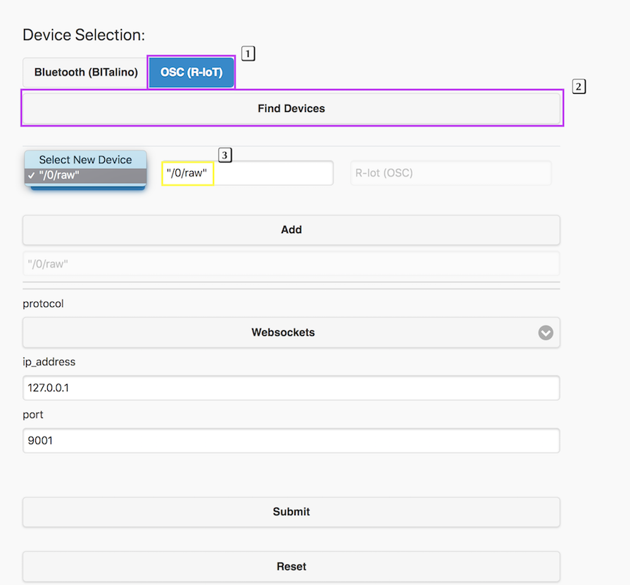
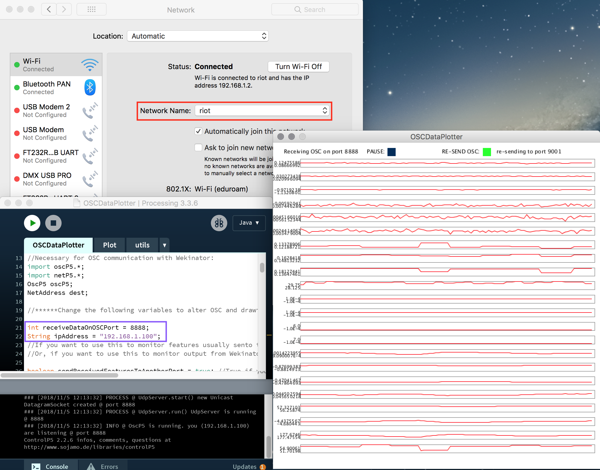

# No router? Setting up a direct Wi-Fi connection using Access Point mode

## AP Mode on the BITalino R-Iot

By enabling Access Point mode, you'll be able to connect to the R-IoT's wireless network directly. From here, the sensor data will stream to an OSC server on your device. You can initiate this connection using ServerBIT.

Please note: the R-IoT's access point only allows for one connection at a time, therefore, this configuration is only suitable for using a single device. In addition, you won't be able to access the internet through your device's Wi-Fi connection. Potential workarounds would be to use an wired Ethernet connection or [switch between network profiles](https://gitlab.com/weselle/riot-serverbit/issues/3#Change%20Computer%20IP%20manually)

## AP Mode on the BITalino R-Iot

By enabling Access Point mode, you'll be able to connect to the R-IoT's wireless network directly. From here, the sensor data will stream to an OSC server on your device. You can initiate this connection using ServerBIT.

Please note: the R-IoT's access point only allows for one connection at a time, therefore, this configuration is only suitable for using a single device. In addition, you won't be able to access the internet through your device's Wi-Fi connection. Potential workarounds would be to use an wired Ethernet connection or switch between network profiles

## Configuring the R-IoT

Step one, turn on the R-IoT whilst holding down the on-board **mode** button. The LED should flash rapidly then become static.

A new Wi-Fi network named **RIOT-\[4 random characters\]** will become available


_For more information, see the_ [_Quick-start Guide_](https://bitalino.com/downloads/quickstart-guide-riot-1.0.0.12-print.pdf)

Connect to this network and go to the following address from your browser: `192.168.1.1`



When using AP mode, it's recommended to set the **ID** to 0 \(default\)

Change the **WIFI Mode** to AP and click `Submit` to save changes

Restart the device in default mode and connect to the `riot` Wi-Fi network


## Streaming data using ServerBIT

Launch ServerBIT and go to the following address on your browser `localhost:9001/config`



Select **OSC \(R-IoT\)** and click **Find Devices**. When the search is complete, the OSC address **/&lt;ID&gt;/raw** should appear in the device dropdown menu

## Test connection

Once the device id is established, ServerBIT will forward the sensor data along with applicable labels to a WebSockets or OSC host. You can test the connection using the following examples

**WebSockets example**

Open `ClientBIT.html` or `riot_threejs_example.html` from [this repo](https://github.com/BITalinoWorld/riot-python-serverbit)


**OSC examples**

Find a list of code templates in our examples repository: [https://github.com/wprimett/bitalino\_riot\_templates](https://github.com/wprimett/bitalino_riot_templates)

You can also download and open this Processing sketch to monitor inputs [OSCDataPlotter.zip](https://github.com/wprimett/R-IoT-Developer-Totorials/tree/9eec5c35e8ccfb353bc6c121501509d2bd2fbcc2/uploads/1a2d9ec4d86e649aac9a0268e8c3ce8d/OSCDataPlotter.zip)



Check that the `receiveDataOnOSCPort` and `ipAddress` variables are set correctly according to the device configuration

## Change Computer IP Manually

On MacOS, go in the system preferences then network preferences. Select the Ethernet connection and change the IP address method to "manually" and set it to 192.168.1.100. Set the network mask to 255.255.255.0.

On Windows, use the network control centre and adjust the card parameter \(select the Ethernet connection then TCP/IP parameter\) and use the same values as above. _On Windows, we recommend doing this from the command line where possible:_

```text
netsh interface ip set address Wi-Fi static 192.168.1.100 255.255.255.0 192.168.1.1
```

On both operating systems, you can also use **network profiles** that allows quick switching between your regular internet configuration \(i.e. using DHCP for most of us\) and a dedicated sensor configuration to play with the R-IoT over a local network \(using a manually set IP address\). MacOS has a profile system in its network preferences. On Windows you might have to install a free software to manage the profiles, like NetsetMan.

