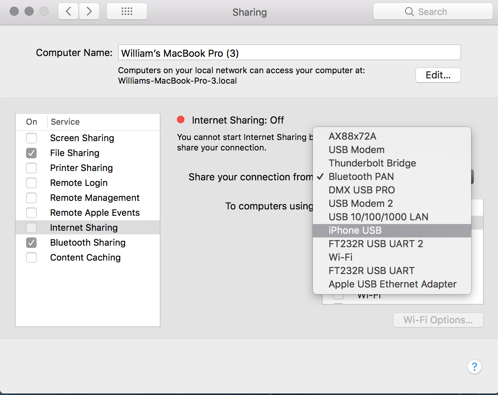

# No router? Setting up a mobile wifi hotspot \(OSX + iPhone Alternative\)

## No router? Setting up a mobile wifi hotspot \(OSX + iPhone Alternative\)

While we recomend having a dedicated router wherever possible, you can also use a mobile phone to emulate this. For Android, you can usually assign a custom SSID and follow the normal protocol. Alternativley, OSX provides some tools to broadcast a dedicated network. Two advantages of this are:

1. It's possible to be tethered by USB, providing a fairly stable connection
2. A separate SSID is created, no need to change the configuration on the phone's default hotspot or on the R-IoT

From **Preferences -&gt; Sharing** Select your external connection e.g ethernet or USB/Bluetooth to mobile device.



Go to **Wifi options**, enter matching SSID to R-IoT device \(**"riot"**\) and set security to **none** 


Turn on the R-IoT and enable internet sharing. If connected, the on-board LED should go from green to blue

To receive the data on the computer, you'll need to change your IPv4 address to match the device configuration. Run the following command

```text
sudo ifconfig en0 192.168.1.100 netmask 255.255.255.0
```

Use this Processing sketch to monitor inputs directly:



#### ServerBIT/Websockets Test

To use the WebSocket examples, run the main python script and open **ClientBIT.html**

\*\*\*\*[**https://github.com/BITalinoWorld/riot-python-serverbit**](https://github.com/BITalinoWorld/riot-python-serverbit)\*\*\*\*

```text
$ python3 riot_serverBIT.py -ssid 'riot' --ip '192.168.1.100' --port 8888 --id 0
```

