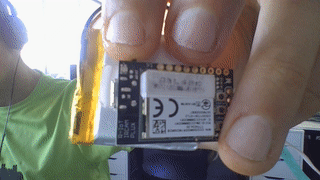
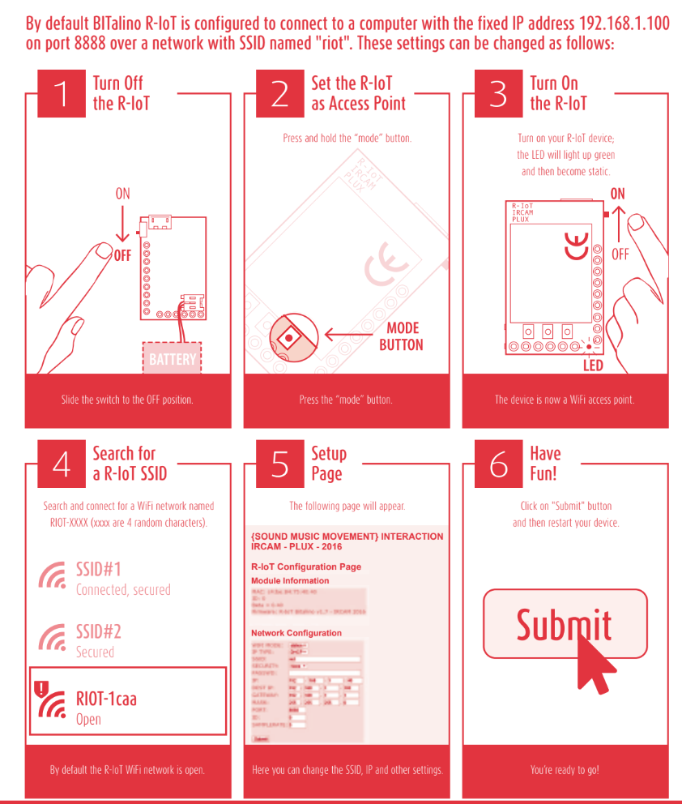
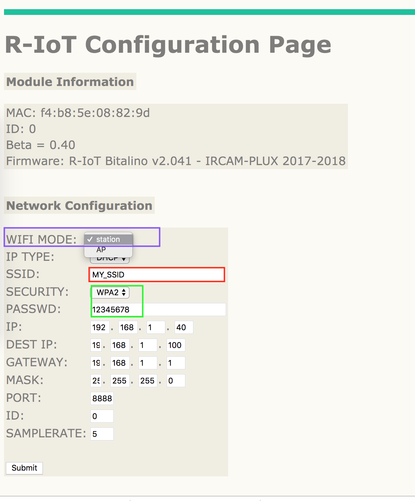
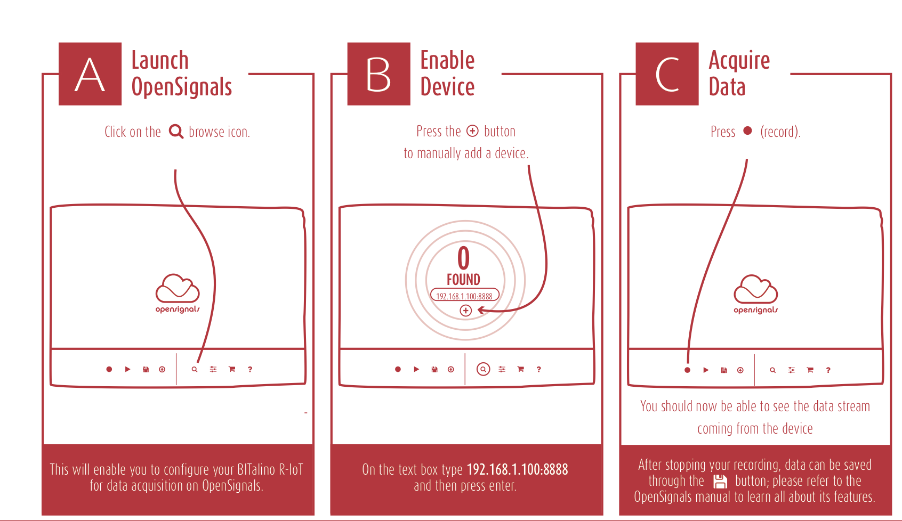

# Use the R-IoT with your home router

## I already have a wireless router, can I use this with the R-IoT?

Out of the box, the BITalino R-IoT module is set up to work with our pre-configured routers, which can be found in the [PLUX online store](https://store.plux.info/accessories/403-wireless-route-bitalino-riot-810121713.html). This is intended to provide a straightforward connection process with minimal interference.

Nonetheless, if you would prefer to use your own wireless router, you can do so by accessing the R-IoT configuration page from your computer.

If this is your first time connecting the R-IoT, we recommend setting up a direct connection using the built-in Access Point mode using the [following guide](https://gitlab.com/weselle/riot-serverbit/issues/3). This goes over the fundamental steps for accessing the on-board configuration and should help you get more comfortable with receiving the sensor data from your computer.

## **Accessing the R-IoT Configuration**

Step one, turn on the R-IoT whilst holding down the on-board **mode** button. The LED should flash rapidly then become static 🔵

A new Wi-Fi network named **RIOT-\[4 random characters\]** will become available

_For more information, see the_ [_Quick-start Guide_](https://bitalino.com/downloads/quickstart-guide-riot-1.0.0.12-print.pdf)

Connect to the new WiFi network and go to the following address from your browser: `192.168.1.1`💻

## Changing and Saving the Configuration

After following the steps above, you should see the following page:

**WIFI MODE**

To connect via an external wireless router, you'll have to check **station** mode is enabled. This should be set by default, however, if you were following the AP mode tutorial prior to this, be sure to change this back.

**SSID**

The R-IoT connects to the network name set in the SSID field above. It should match the network name set in your WiFi access point

**Password/WPA-2**

If it's possible to disable the password on your local network, you can simply set security option to **None** and simplify the connection process. If some security is absolutely needed, WPA-2 can be enabled along with a password or passphrase, however security uses more bandwidth and can be trickier to configure for novice users. If the goal is to prevent unwanted access to the local network during sensor streaming and collection, it is actually easier to setup a MAC address filtering in the Access Point itself. In addition, the SSID beaconing can be disabled \(also on the Access point\) to prevent finding the name of the network, therefore allowing connection only to parties who know the said SSID name.

**Other Settings**

* In DHCP mode, there's no need to fill up the gateway and mask fields, those will be provided by their DHCP server.
* For your first trial, we recommend keeping the default DEST IP, PORT and ID. 

**Apply New Configuration**

Review the configuration form and click `Submit` to save changes

Restart the device in default mode by flipping the on/off switch.

## **Testing The Connection with OpenSignals**

Upon restart, your machine will be automatically disconnected from the RIOT-XXXX network. Connect to your router and change your IPv4 address accordingly. You'll need to change the IPv4 address of your computer to match the destination address of the R-IoT \([more info](https://gitlab.com/weselle/riot-serverbit/issues/3#change-computer-ip-manually)\).

From there follow the instructions in [this guide ](https://bitalino.com/downloads/quickstart-guide-riot-1.0.0.12-print.pdf)to bridge the connection and visualize the incoming data in [OpenSignals \(r\)evolution.](https://bitalino.com/en/software)

**Direct Data Transmission - OSC**

Find a list of code templates in our examples repository: [https://github.com/wprimett/bitalino\_riot\_templates](https://github.com/wprimett/bitalino_riot_templates)

